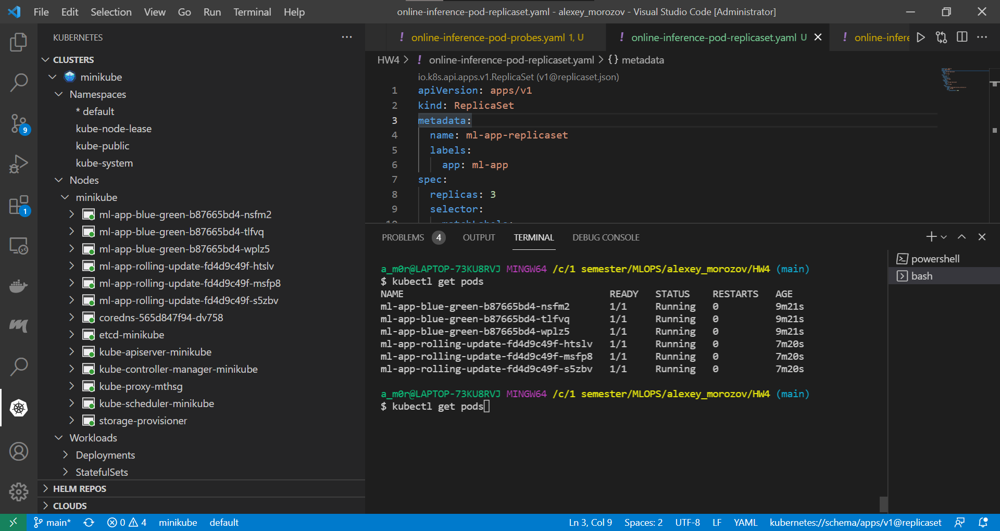

# Установка
Kubernetes установлен локально на windows 10 при помощи `minikube`, в качестве виртуальной машины выступает `docker`


# Развернутый кластер


# Манифесты
```bash
kubectl apply -f online-inference-pod.yaml 
kubectl apply -f online-inference-pod-resources.yaml 
kubectl apply -f online-inference-pod-probes.yaml 
kubectl apply -f online-inference-pod-replicaset.yaml 
kubectl apply -f online-inference-pod-deployment-blue-green.yaml
kubectl apply -f online-inference-pod-deployment-rolling-update.yaml
```

В `online-inference-pod-probes.yaml` были написаны:
- `readinessProbe`: спустя 20 секундр после старта контейнера каждые 5 секунд проверяем по http запросу `/health`;
- `livenessProbe`: спустя 30 секунд после старта контейнера каждые 10 секунд выполняем команду `cat /tmp/healthy`. В свою очередь, при запуске контейнера была выполнена следующая команда `touch /tmp/healthy; sleep 60; rm -f /tmp/healthy`. Таким образом, в течении первой минуты файл `healthy` существует и pod живой, далее файл удалиться и pod умрет.

# Ответ на вопрос касательно `ReplicaSet`
Поды с какими версиями образа будут внутри кластера?
Что будет, если сменить docker образ в манифесте и одновременно с этим:
- а) уменьшить число реплик - **ничего не произойдет, количество реплик уменьшится, но те, что останутся, будут содержать старый docker образ**;
- б) увеличить число реплик - **новые реплики будут с новым docker образом, а старые со старым**.


# vs code
